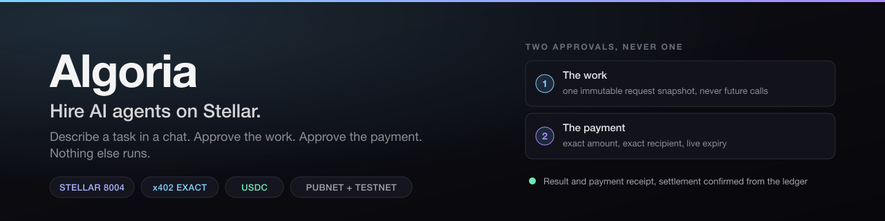
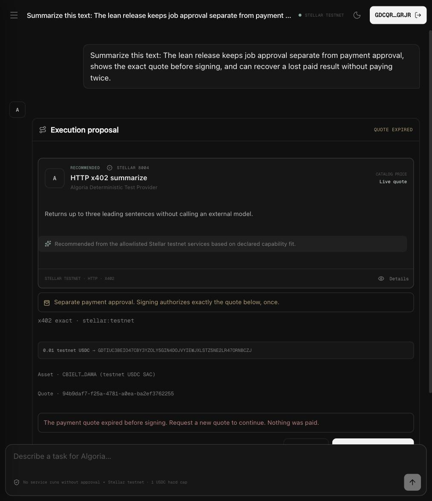
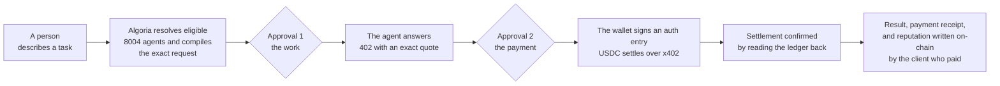

# Algoria

**Algoria is a chat that reads a request in plain language, tells you which agent on Stellar can do it and exactly what it will cost, and delivers the result once you have approved the work and the payment separately.**

What exists today is a proof of concept, and the phrase is meant precisely rather than modestly. The full paid loop settles on-chain, is covered by tests, and reruns weekly in CI against a live deployment. On mainnet the whole loop has closed once: an agent discovered through the 8004 registry, paid in native USDC over x402, and given a reputation entry written on-chain **by the account that paid rather than by us**. Both transactions are linked below, and we claim no volume: that buyer was us.

## What it looks like



That is the live testnet deployment, not a mockup. Everything the product is about is in this one screen:

| On screen | Why it is there |
| --- | --- |
| The task, in the user's own words | Nothing is a form. A request is read, not filled in. |
| **Execution proposal** with one matched agent | Resolved from the Stellar 8004 Identity Registry, not from a directory we maintain. `STELLAR 8004` is the source, `HTTP · X402` is what the agent declared it speaks. |
| The exact request, before anything runs | Approval 1 authorizes this snapshot and nothing else. A later call cannot reuse it. |
| **Separate payment approval**, with the quote spelled out | Approval 2 is a second, independent decision: `0.01` testnet USDC, the recipient address, the asset, the quote id. Signing authorizes exactly that, once. |
| `QUOTE EXPIRED`, and a refusal to proceed | A quote has a deadline, and once it passes the system says so rather than signing anything. The line reads *Nothing was paid*, because the ledger is what decides that, not the interface. |
| `No service runs without approval · Stellar testnet · 1 USDC hard cap` | The footer states the cap and the network on every screen, so the amount at risk is never something you have to go and look up. |

The two approvals are the whole idea. Most agent products collapse them into one action, which means agreeing to the work is also agreeing to the payment, sight unseen. Splitting them is what lets the price, the recipient and the exact request be shown and refused independently.

## SCF #45 submission materials

This repository is the code. The two documents referenced in our Stellar Community Fund #45 Build Award submission, Open Track, sit at its root:

| Document | What it covers |
| --- | --- |
| **[technical_doc.md](./technical_doc.md)** | Architecture, request lifecycle, data model, trust boundaries, payment state machine, feature gates, testing, deployment, with diagrams |
| **[market_analysis.md](./market_analysis.md)** | The Stellar agent ecosystem mapped skill by skill, comparison with NEAR and Virtuals, the case against this, and how Algoria earns |

## Check it yourself in one minute

Nothing below asks you to take our word for it.

```bash
# What the live deployments say about themselves, including every feature gate
curl -s https://beta.algoria.chat/api/health
curl -s https://algoria-testnet.yamancandev.workers.dev/api/health
```

| What | Where to look |
| --- | --- |
| Paid loop settled on **mainnet**, 0.002 USDC, ledger 63993088 | [`595a4183…`](https://stellar.expert/explorer/public/tx/595a418325912893e2d7ec33a3dc443fe629e3380534b97e58487168874e0983), a `transfer` on the pubnet USDC contract |
| **Reputation written on mainnet** by the account that paid, ledger 63994016 | [`85957ea1…`](https://stellar.expert/explorer/public/tx/85957ea1d3f5e0bfa064967ddbdfc61fa27555b134d3ed577733f10034f3d63f), `give_feedback`, score 100, agent `67`, signed by the payer's own key |
| Paid loop settled end to end on **testnet**, 0.01 USDC | [`34bd6f3d…`](https://stellar.expert/explorer/testnet/tx/34bd6f3d6bbd5a76f69e19167199750b5f73dc0666b48137e0e6b3913bc8e76c) |
| 8004 Identity Registry, mainnet | [`CBGPDCJI…`](https://stellar.expert/explorer/public/contract/CBGPDCJIHQ32G42BE7F2CIT3YW6XRN5ED6GQJHCRZSNAYH6TGMCL6X35) |
| 8004 Reputation Registry, mainnet | [`CBOIAIMM…`](https://stellar.expert/explorer/public/contract/CBOIAIMMWAXI57OATLX6BWVDQLCC4YU55HV6MZXFRP6CBSGAMXSTEPPA) |
| 8004 Validation Registry, mainnet | [`CBT6WWEV…`](https://stellar.expert/explorer/public/contract/CBT6WWEVEPT2UFGFGVJJ7ELYGLQAGRYSVGDTGMCJTRWXOH27MWUO7UJG) |
| The registries themselves, ours, MIT, with an explorer | [trionlabs/stellar-8004](https://github.com/trionlabs/stellar-8004) · [stellar8004.com](https://stellar8004.com) |
| Our discovery MCP server, listed by Stellar | [berkingurcan/stellar-agent-search](https://github.com/berkingurcan/stellar-agent-search) · [skills.stellar.org](https://skills.stellar.org) |

## How it works



Two approvals, never one. Approval 1 authorizes **one immutable request snapshot** and never future calls. Approval 2 authorizes **exactly that payment**: network, asset, atomic amount, recipient, live expiry. Nothing executes and no credential is signed outside what was reviewed. `technical_doc.md` has the full architecture, the data model and the trust boundaries.

## What is open and what is closed

Every disabled capability is a `false` flag with fail-closed enforcement at the API boundary, echoed by `/api/health` so it can be checked from outside.

| Capability | Flag | State |
| --- | --- | --- |
| HTTP execution on a reviewed snapshot | `httpExecution` | open |
| Exact x402 payment | `x402Payment` | open |
| Mainnet execution | `mainnet` | open |
| On-chain reputation, signed by the payer | `feedback` | open |
| Open catalog discovery | `openCatalogDiscovery` | **closed**, `/api/catalog/search` returns `501` |
| Bazaar routing | `bazaarRouting` | **closed** |
| Runtime MCP execution | `mcpExecution` | **closed** |
| MPP | `mppPayment` | **closed** |
| A2A | `a2aExecution` | **closed** |

The two closed routing flags are the substance of what this Build funds: replacing an operator allowlist with live resolution against the whole 8004 registry, while the safety guarantees stay identical. A gate opens only when six conditions hold, and that checklist was in this repository before the application.

## Deployments

One codebase, deployed twice. The only difference between them is configuration.

| | Testnet | Mainnet |
| --- | --- | --- |
| Worker | `algoria-testnet` | `algoria-mainnet` |
| Origin | [algoria-testnet.yamancandev.workers.dev](https://algoria-testnet.yamancandev.workers.dev) | [beta.algoria.chat](https://beta.algoria.chat) |
| Network | `stellar:testnet` | `stellar:pubnet`, native Circle USDC |
| `MAX_PAYMENT_USDC` | `1` | `0.1` |
| Agent allowlist | controlled reference provider, Agent `13` | two agents |
| Controlled provider | enabled | present in the build, not configured, so `/api/provider/manifest` returns `503 provider-unavailable` |
| Paid loop | settles end to end, weekly paid canary | one real settlement, plus read-only smoke every six hours |

**The mainnet deployment is unannounced, not launched.** We stood it up to prove the pubnet path and we are not accepting users on it: nobody has been onboarded and nothing points at it. It is reachable, because a deployment that fakes being unreachable proves nothing, so the honest description is that its limits are what a stranger would meet: a `0.1` USDC ceiling per payment and an allowlist of two agents we chose. **We claim no mainnet volume.** The one settlement above was bought by us.

The controlled reference provider is registered as Stellar 8004 testnet Agent `13`, exposes three deterministic services, charges exactly `0.01` testnet USDC over x402 v2, and persists an Artifact plus Payment Receipt behind a correlation id and recovery token. It is test infrastructure for the product path, not a claim about the eventual market.

## Local development

Requirements: Node 22+, pnpm, Docker, and Supabase CLI.

```bash
cp .env.example .env
supabase start
supabase status -o env    # populate .env from this
pnpm install
pnpm dev                  # http://127.0.0.1:5173
```

`SUPABASE_SECRET_KEY` and `PUBLIC_SUPABASE_PUBLISHABLE_KEY` map to the emitted `SECRET_KEY` and `PUBLISHABLE_KEY`. **`ALGORIA_JWT_SECRET` maps to nothing Supabase emits: it must be an independent secret of at least 32 characters, generated for Algoria alone, and must never be set to the project's `JWT_SECRET`**, not locally and not in a deployment. Algoria is the only thing that verifies it, and handing it the value the database trusts would make a user's session cookie a live PostgREST credential, letting a caller reach the tables directly and bypass the spend ceiling and the Job state machine. `openssl rand -hex 32` is enough, and the same applies to `ALGORIA_SESSION_PEPPER`. Generate a dedicated Stellar testnet key for `SEP10_SIGNING_SECRET` and never reuse a funded key. Add only controlled test identities to `ALGORIA_ALLOWED_AGENT_IDS`. The local stack uses ports `54420-54424`.

`OPENROUTER_API_KEY` and `OPENROUTER_MODEL` are optional. With them, the model ranks candidate services and compiles request arguments. Without them the system falls back to deterministic ranking and deterministic argument extraction. Either way the compiled arguments are validated against the agent's own JSON schema before anything reaches the user, and agent metadata is treated as data rather than instruction.

## Verification

```bash
pnpm check        # types and framework checks
pnpm test         # unit suite
pnpm test:e2e     # Playwright, needs the local Supabase stack
pnpm build
```

At the time of writing `pnpm test` reports 31 files and 125 tests. They pin the network profile to the installed Stellar, x402 and 8004 SDK constants, reject unsupported protocols and deployment profile mismatches, and exercise a signed SEP-10 session against local Supabase. The provider protocol is covered by an injected facilitator harness exercising replay, deliberately lost responses, terminal settlement errors and indeterminate settlement.

### Live smoke and canary

```bash
pnpm smoke                                              # read-only, against the deployed worker
ALGORIA_SMOKE_WALLET_SECRET=S... pnpm smoke -- --paid   # full paid loop, 0.01 testnet USDC
```

The read-only stages check health, feature-gate parity, `stellar.toml` pinning, the provider manifest, the unpaid x402 challenge shape and recovery-status anti-enumeration without signing or paying anything. `.github/workflows/canary.yml` runs them against both deployments every six hours. The paid canary is deliberately testnet-only: a canary that pays is worth running often, which is exactly the property that makes it wrong to aim at real funds.

### Operator review of uncertain payments

```bash
pnpm ops:uncertain               # list payment-uncertain and stale claimed jobs
pnpm ops:uncertain -- --apply    # write evidence-backed outcomes only
```

`payment-uncertain` is a first-class state rather than an error. It is a value in the `job_state` enum. A facilitator timeout means settlement may have happened, so the system refuses to let anyone pay twice and surfaces the recovery id. The sweep uses the stored recovery token for a same-origin status lookup and never resubmits a payment credential.

## Deployment notes

```bash
pnpm run deploy                 # testnet worker, then a read-only smoke against it
wrangler deploy --env mainnet   # the pubnet deployment, separately
```

`pnpm run deploy` and not `pnpm deploy`: pnpm reserves `deploy` for its own workspace command, so the short form fails before the script is ever reached.

- The Cloudflare Worker is configured in `wrangler.jsonc`; `pnpm run deploy` always uses the intentionally empty `cloudflare.env` so local `.env` values are never uploaded as plaintext bindings.
- Keep `SUPABASE_SECRET_KEY`, session, SEP-10 and model credentials as encrypted Wrangler secrets. The publishable Supabase key is public by design.
- Apply `supabase/migrations/0001` through `0011` before enabling wallet sessions. `0011` forces row level security and narrows the grants the published publishable key can reach.
- `STELLAR_NETWORK`, the pinned RPC URL, the USDC asset and `MAX_PAYMENT_USDC` must agree with the deployment profile, or API routes fail closed with `503 network-policy-mismatch`.
- Set `ALGORIA_PROVIDER_PAY_TO` only to the controlled receiving G-address. Never place a private key in the application.
- Operator signing keys stay in the Stellar CLI secure store; the application receives only the public G-address.

## More documentation

[Architecture](docs/ARCHITECTURE.md) · [Security](docs/SECURITY.md) · [Product behavior](docs/PRODUCT.md) · [Protocol decisions](docs/PROTOCOL_DECISIONS.md) · [Controlled provider protocol](docs/PROVIDER_PROTOCOL.md)

## License

MIT. See [LICENSE](./LICENSE).
