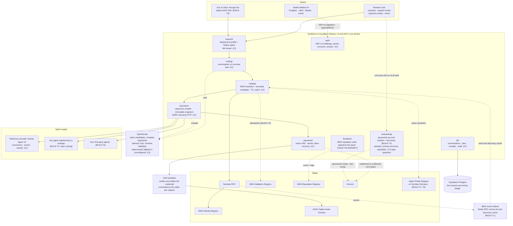
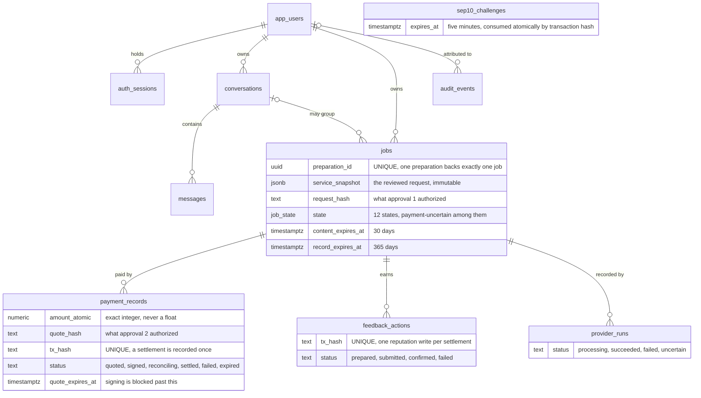
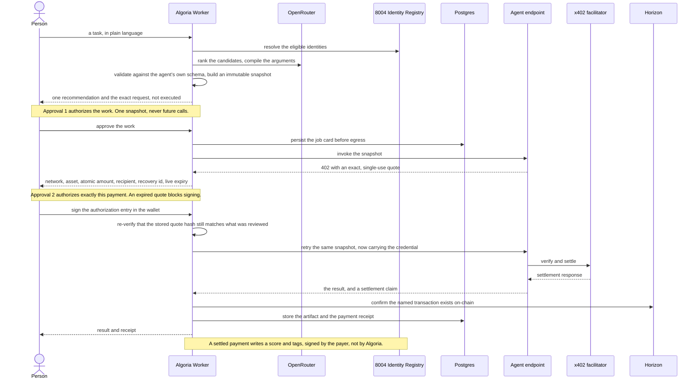
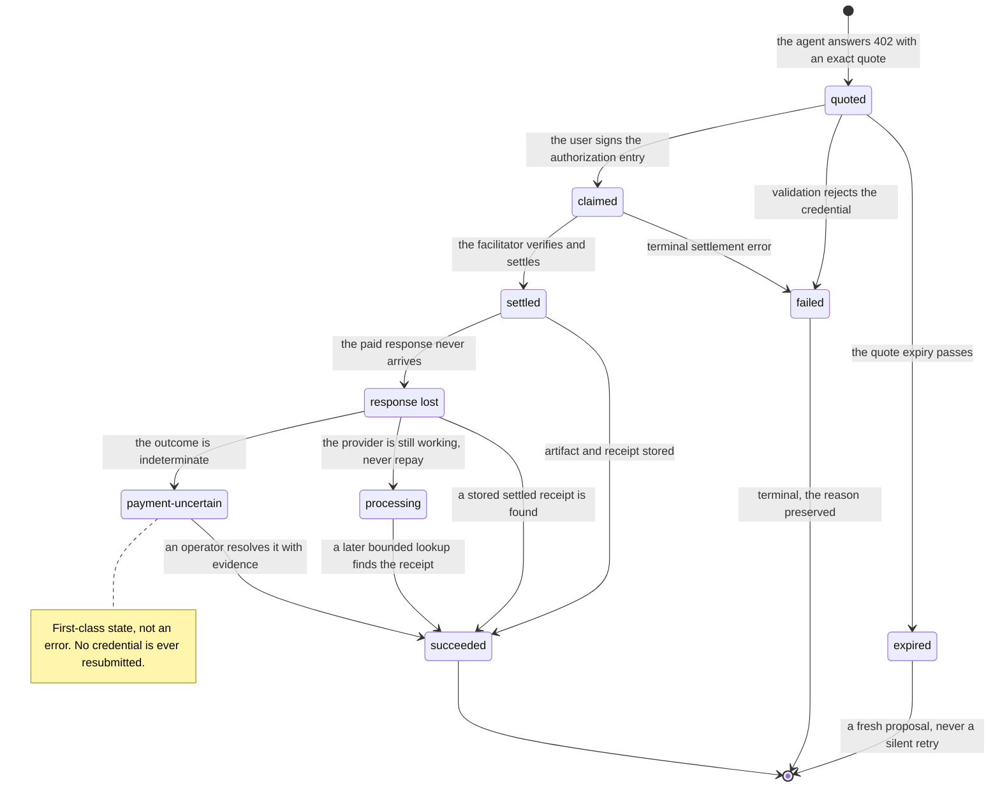

# Algoria: Technical Architecture

**Status: 2026-08-17.** Algoria is a proof of concept whose full paid loop settles on-chain and reruns weekly in CI. This document describes what runs today, the engineering doctrine behind it, and exactly what the SCF Build funds.

It runs in **two deployments**. A testnet deployment carries the controlled reference provider and is where the full paid loop settles end to end. A **client-only mainnet deployment** at `beta.algoria.chat` runs against Stellar pubnet with native USDC, held at a `0.1` USDC cap with a two-agent allowlist and no provider configuration, so `GET /api/provider/manifest` there returns `503 provider-unavailable`.

**The mainnet deployment is unannounced, not launched.** We stood it up to prove the pubnet path, and we are not accepting users on it: nobody has been onboarded and nothing points at it. It is reachable, because a deployment that fakes being unreachable proves nothing, so the honest description is that its limits are what a stranger would meet: a `0.1` USDC ceiling per payment, and an allowlist of two agents we chose. What remains gated there is open catalog discovery and permissionless routing.

The paid loop has settled on mainnet with real value. Stated as narrowly as the ledger supports: `0.002` USDC, a `transfer` on the pubnet USDC Stellar Asset Contract, to the payment address the agent named in its `402` quote, in transaction `595a418325912893e2d7ec33a3dc443fe629e3380534b97e58487168874e0983` at ledger 63993088, confirmed by reading the ledger back rather than taking the facilitator's word for it. What the chain proves is the transfer. It does not prove whose address that was, because 8004 registration carries no binding payment address today. See the trust boundaries in section 5, and the contract this Build adds to close exactly that gap.

Ninety minutes later the same account wrote the reputation entry: `give_feedback` on the mainnet Reputation Registry, score 100 for agent `67`, transaction `85957ea1d3f5e0bfa064967ddbdfc61fa27555b134d3ed577733f10034f3d63f` at ledger 63994016. **Discovery, payment and reputation therefore close on pubnet, and the key that signed the review is the key that paid**, not ours. Both transactions are in section 8.

**That is a proven path, not volume.** The buyer was us. There are no paying users because we are not taking any yet, which is a different statement from nobody having come, and either way we would rather say so than count our own transaction as traction. The weekly *paid* canary remains deliberately testnet-only, because a canary that pays is worth running often, which is exactly the property that makes it wrong to aim at real funds.

Everything marked *exercised in CI* is in the repository and verified by unit tests and a live canary against a running deployment. That is deliberately not the same claim as *open to use*: every capability outside the one proven path is a `false` feature flag that fails closed at the boundary.

---

## 1. What Algoria is

**Algoria is a chat that reads a request in plain language, tells you which agent on Stellar can do it and exactly what it will cost, and delivers the result once you have approved the work and the payment separately.**

That is the whole product. A person describes a task, reviews the agent and the exact request that will be sent, approves it, separately approves the exact payment, and receives the result with a receipt.

What exists today is a **proof of concept**, and the phrase is meant precisely rather than modestly: its full paid loop settles on-chain, is covered by tests, and reruns weekly in CI against a live deployment. It is deliberately narrower than the product. Its purpose is to prove one trustworthy end-to-end path, covering identity, invocation, payment, replay and recovery, before widening it. Every capability outside that path is a `false` feature flag with fail-closed enforcement, not a half-built feature.

**The design principle is consent exactness:** the user authorizes one immutable request snapshot and one exact payment. Nothing executes, and no credential is signed, outside what was reviewed.

---

## 2. Stellar Integration

Every component below is a Stellar primitive. Tranche is when this Build touches it. Status uses the vocabulary set out above, and nothing in this table is open to the public yet.

| Stellar building block | How Algoria uses it | Status | Tranche |
| --- | --- | --- | --- |
| **Soroban smart contracts** | The new Agent Profile Registry maps a name under a project-owned `.xlm` root to an 8004 agentId, address and metadataURI. Two entrypoints plus a metadata pointer. | To build | T1 testnet, T3 mainnet |
| **Stellar 8004 Identity Registry** | Every agent Algoria can reach is resolved from this contract through our own `@trionlabs/stellar8004` `IdentityClient`. Today against an operator allowlist; from T2 against the whole registry. Mainnet `CBGPDCJIHQ32G42BE7F2CIT3YW6XRN5ED6GQJHCRZSNAYH6TGMCL6X35` | Deployed on mainnet, ours, MIT | T2 |
| **Stellar 8004 Reputation Registry** | A settled payment lets its payer write a reputation entry, one score plus up to two tags, the shape the contract stores, inside the same completed job, with self-review prevention enforced by the contract. **The client who paid signs that write with their own key**. Algoria builds the transaction and never holds a key that could author a review on someone's behalf, so a reputation entry is attributable to the account that actually paid. Mainnet `CBOIAIMMWAXI57OATLX6BWVDQLCC4YU55HV6MZXFRP6CBSGAMXSTEPPA` | Open; helpers and refusals unit-tested, and the write exercised on mainnet, with the transaction in section 8 | T2 |
| **Stellar 8004 Validation Registry** | Third-party attestations surfaced on agent profile cards. | Contract deployed on mainnet, ours. Nothing in Algoria reads it yet: the address is pinned in the network profile and no code path calls it, so surfacing attestations is Build work | T2 |
| **x402 exact payment over Soroban auth entries** | The payment path. `@x402/stellar` `ExactStellarScheme`, quote parsed and re-verified server side, credential signed through `signAuthEntry`. | Exercised in CI on testnet; settled once on mainnet | T1, T3 |
| **Stellar Asset Contract, USDC** | Unit of account for every paid job. Testnet SAC `CBIELTK6YBZJU5UP2WWQEUCYKLPU6AUNZ2BQ4WWFEIE3USCIHMXQDAMA`; native Circle USDC `CCW67TSZV3SSS2HXMBQ5JFGCKJNXKZM7UQUWUZPUTHXSTZLEO7SJMI75` on mainnet, where a `transfer` has settled. | Exercised in CI on testnet; settled once on mainnet | T3 |
| **SEP-10 Web Authentication** | Wallet-based session auth, network-agnostic: the challenge is built and verified against the active network passphrase. Challenges expire in five minutes and are consumed atomically by transaction hash in Postgres. | Exercised in CI on both networks | in place |
| **Stellar Wallets Kit** (SCF integration list) | Wallet connection and signing across the kit's default modules: Freighter, xBull, Albedo, Lobstr and the rest. Provides the `signAuthEntry` capability x402 requires. | In use. What CI exercises is the SEP-10 and x402 signing paths against a raw keypair, because a browser extension cannot be driven in CI; the kit itself is checked by hand | in place |
| **Fee-bump transactions and sponsored account creation** | A new user pays for their first agent job without holding XLM. Algoria sponsors the base reserve and the network fee inside a per-user cap. | To build | T1 |
| **Stellar RPC** | On-demand contract reads for 8004 resolution through the pinned SDK, memoized in a bounded in-process cache with single-flight de-duplication and a TTL. The event indexer that would turn this into real-time discovery is Build work; it is not running today. | Exercised in CI | T1 |
| **Horizon** | Independent settlement verification. A facilitator's `PAYMENT-RESPONSE` header is treated as a claim, not proof: the transaction it names is confirmed against Horizon before a job is recorded as settled. | Exercised in CI | in place |
| **Soroban Domains** | Registration of the project-owned `.xlm` root that the Agent Profile Registry layers agent subdomains on top of. | To build | T1 |
| **A pubnet-capable x402 facilitator**, for example the OpenZeppelin Relayer plugin | Only ever a *seller*-side choice. Our reference provider settles through the default `https://x402.org/facilitator`, which covers testnet only, and the URL is configuration rather than code. A first-party agent charging on pubnet therefore needs a pubnet-capable facilitator. As a buyer, Algoria does not choose a facilitator at all: the seller names one in its `402` quote. | To integrate, for our own agents | T3 |
| **Stellar CLI secure store** | Operator signing keys stay in the OS keychain. The application receives only the public G-address; no private key enters the Node process, environment or command arguments. | In use | in place |
| **stellar/stellar-dev-skill** | Algoria is developed using Stellar's official AI development skill, which keeps the implementation aligned with current Soroban and SDK practice. | In use | ongoing |
| **Passkey contract accounts, secp256r1** | Investigated in T3. A contract account authorizing through `check_auth` would remove the browser-extension step. Open question: whether the x402 exact scheme accepts authorization from a contract account rather than a classic keypair signing an auth entry. Result published either way. | Open question | T3 |

**On Privy and hosted wallet services.** Privy and DFNS are on the SCF integration list and would give social-login onboarding in about a day. We chose sponsored native Stellar accounts instead for two reasons. x402 on Stellar settles through Soroban auth entries, and the signing path we already run goes through Stellar Wallets Kit's `signAuthEntry`, so a hosted signer adds a dependency without removing a step. And a payments product whose core promise is that the user approves every payment exactly should not introduce a third party between the user and their key. Sponsored account creation plus fee-bump removes the funding barrier without moving custody.

**Why these and not others.** Algoria settles value, proves identity and records reputation on Stellar. It does not put conversation content on-chain, because Stellar's throughput and per-operation cost are designed for value transfer rather than message streams. Messages travel in envelopes signed by the sender's Stellar key, so identity and auditability stay anchored to the network while the transport stays off it.

---

## 3. System overview

The architecture below is the end state. Every box carries its status, so one picture shows what runs today and what this Build adds.

Marker key, using the vocabulary set out above: `(CI)` exercised in CI · `(GATED)` implemented and switched off, fails closed at the boundary · `(BUILD)` funded by this application, with its tranche

### One codebase, two deployments

| | Testnet deployment | Mainnet deployment |
| --- | --- | --- |
| Worker | `algoria-testnet` | `algoria-mainnet` at `beta.algoria.chat` |
| Network | `stellar:testnet` | `stellar:pubnet`, native Circle USDC |
| Payment cap | 1 USDC | `0.1` USDC |
| Agent allowlist | reference provider, Agent `13` | two agents, `10` and `67`, and within them only the routes the operator named |
| Controlled provider | enabled | present in the build, not configured, so `/api/provider/manifest` returns `503 provider-unavailable` |
| Paid loop | settles end to end, weekly paid canary | one real settlement, `0.002` USDC, plus read-only smoke every six hours |

### Component map

### Why each outside dependency is there

**OpenRouter, because the input is prose and the contract is a schema.** A person writes *summarise this page*; the registry answers with self-declared names, descriptions and JSON schemas. Two translations are unavoidable: which of the eligible services fits the request, and what exact request body satisfies the chosen agent's schema. The model does both and neither decision is left to it: its ranking only reorders services the allowlist and the contract already made eligible, its compiled arguments are validated against the agent's own schema before anything is shown, agent metadata reaches it as `selfDeclaredDescription` after sanitization so untrusted text is never an instruction, and with no API key configured the system falls back to deterministic ranking and argument extraction rather than failing. The user still reviews the exact request before it executes. A router rather than a single vendor keeps the model a per-task cost decision instead of a dependency.

Routing stays open to a signed-out visitor, because seeing what Algoria would do is the whole landing page. The model call behind it does not: reaching the model is opt-in in the code rather than opt-out, a signed-out caller gets the deterministic local ranking, and `/api/router` carries its own bucket of 20 requests a minute. Stated honestly, the session requirement bounds *who* spends the operator's model balance rather than how much. SEP-10 authenticates any valid keypair, funded or not, so a session is cheap to obtain, and the bucket is what bounds the rate. A per-session model budget is the control that would bound the spend itself, and this deployment does not have one.

**A facilitator, because the payer signs and does not submit.** x402 settles through a Soroban authorization entry: the wallet signs an entry, it does not broadcast a transaction. Someone has to verify that credential and settle it on-chain, and that someone must not be the buyer. Putting it behind the agent is the point of a machine-payable web: a seller needs to answer `402` and nothing else, with no Stellar infrastructure of its own. That also means the facilitator is not ours to pick. It arrives named in the seller's quote, one request at a time, and a seller that changes facilitator changes nothing on our side, which is why "integrating a facilitator" is a statement about the agents we operate, not about the client. Whoever it is, Algoria treats the returned `PAYMENT-RESPONSE` as a claim rather than proof and confirms the named transaction against Horizon before recording a job as settled.

**Cloudflare Workers, because the runtime itself can refuse a bad destination.** One Worker serves the UI and the API, with static assets on the CDN, deployed twice from one codebase with only environment variables differing. The `global_fetch_strictly_public` compatibility flag means the platform, not only application code, rejects private, loopback and link-local destinations, which is the strongest available answer to SSRF in a product whose whole job is calling URLs an untrusted registry supplied. Node development pins DNS through Undici to keep the same guarantee locally.

**Supabase Postgres, because consent and money need a ledger, not a cache.** Persistence is server-side only through the secret key; Algoria's own JWTs are never presented to PostgREST as Supabase Auth tokens, queries bind the authenticated user UUID explicitly, and row level security, forced on every table so not even the owning role is exempt, with explicit table grants sits underneath as defense in depth. The schema is what makes the safety properties real rather than intended: SEP-10 challenges are consumed atomically by transaction hash so a challenge cannot be replayed, quotes are claimed through an atomic state transition so one quote cannot pay twice, execution preparations are single-use, provider runs store only the hash of a recovery token, and the job card is written **before egress** so an interrupted run survives a reload.

**MCP, in two directions that should not be confused.** Outward, Algoria is published as an installable skill so any AI client can discover and hire a Stellar agent through it, which is Tranche 3 and follows the same pattern already shipped in Stellar Agent Search. Inward, agents that speak MCP rather than plain HTTP are a different question: the client and tool-selection path exist in the repository with no callers, `mcpExecution` is `false`, and it stays deferred with its consent problem written down, because a tool call chosen at runtime cannot be pinned to one reviewed request snapshot the way an HTTP call can.

### The data model, and the guarantees the schema enforces

Consent and money are not application state that happens to be saved. They are table constraints, which is the difference between a property we intend and a property that holds.

| Property | What actually enforces it |
| --- | --- |
| A settlement is recorded at most once | `payment_records.tx_hash` is `unique`, so a duplicated settlement is a database error rather than a second charge |
| A job earns at most one reputation entry | `feedback_actions.tx_hash` is `unique` |
| One preparation backs exactly one job | `jobs.preparation_id` carries a unique index, which is what makes a preparation single-use |
| Money is exact | `amount_atomic numeric(40,0)` with a non-negative check. Atomic integers, never a float, never a rounded display value |
| A challenge cannot be replayed | `sep10_challenges` rows expire in five minutes and are consumed atomically by transaction hash |
| What the user approved is recoverable | `service_snapshot` and `request_hash` are columns, so the reviewed request survives independently of any later state |
| Conversation content does not outlive its purpose | `content_expires_at` defaults to 30 days while `record_expires_at` defaults to 365: the conversation is deleted long before the money record, deliberately |

### Three state machines, deliberately separate

The most common way to get a payments product wrong is to let one status mean two things. A job, a payment and the provider's own record therefore keep separate vocabularies, and they are separate columns:

| Machine | Column | States |
| --- | --- | --- |
| Job | `jobs.state` | `routing`, `awaiting-agent-selection`, `needs-input`, `awaiting-job-approval`, `probing`, `awaiting-payment`, `signing`, `executing`, `payment-uncertain`, `succeeded`, `failed`, `cancelled` |
| Payment | `payment_records.status` | `quoted`, `signed`, `reconciling`, `settled`, `failed`, `expired` |
| Provider record | `provider_runs.status` | `processing`, `succeeded`, `failed`, `uncertain` |

A settled payment does not by itself make a succeeded job, and that gap is where the recovery path lives. `payment-uncertain` is a value in the `job_state` enum rather than an error string, which is what "first-class state" means here.

Every input crossing into this system is treated as hostile, including inputs a naive design would trust. Section 5 enumerates those boundaries.

### What this architecture does not do yet

Stating the limits is part of describing the system honestly, and each has a named successor.

- **The discovery cache and the rate limiter are per-isolate, with separate bounds.** Both are in-memory maps inside the Worker: the cache holds at most 200 entries and admits 16 concurrent loads, the limiter tracks at most 10,000 keys. On Cloudflare that makes each effectively per isolate, and an evicted isolate starts the limiter's counters again. That is adequate against accidental hammering behind an operator allowlist and it is not an abuse control under open routing. What is isolate-local is the request *rate*, not the money: the per-wallet spend ceiling below is a query over `payment_records`, so it holds whichever isolate serves the request. The successor is a shared store, either a Durable Object or the database we already run, and naming it precisely matters, because the event indexer below does not fix this. It fixes a different problem that the same tranche happens to fund.
- **There is no event indexer today.** 8004 reads happen on demand and are memoized, so discovery is as fresh as a cache entry's TTL rather than as fresh as the chain. Real-time discovery arrives with the indexer.
- **Fee sponsorship is not built.** A user needs XLM for their first transaction until sponsored account creation and fee-bump land in Tranche 1.
- **The mainnet deployment is not a market and is not trying to be one yet.** It carries no controlled provider, it is unannounced, it takes no users, and its single settlement was bought by us. One transaction by the people who built the system proves a path and nothing about demand. Widening it is Tranche 3, gated on a separate security review, reconciliation against real money, and adversarial tests with live funds.
- **A payment address is not yet bound to an identity on-chain.** Until the Agent Profile Registry lands, recipient trust rests on the reviewed quote rather than on the registry, which is a smaller guarantee than it sounds and the reason that contract is in this Build rather than after it.

---

## 4. Request lifecycle

The two approvals are the product. Everything else in this section exists so that nothing happens between them, or after them, that the person did not see.

The numbered account, with the detail the diagram cannot carry:

1. A user sends a message. A conversational layer handles greetings; a concrete task enters routing.
2. Routing considers only eligible Stellar 8004 identities and returns at most one recommended HTTP service.
3. After wallet authentication, the server **re-resolves** the selected identity, verifies the endpoint, compiles the exact request, and displays it **without executing it**.
4. Job approval authorizes **one immutable HTTP request snapshot**. It does not authorize future calls.
5. A free `200` returns directly. A `402` creates a short-lived, single-use **exact** x402 quote.
6. The user reviews network, USDC asset, atomic amount, recipient, recovery id, and a live expiry countdown, then signs in the wallet. An expired quote blocks signing and offers a fresh run rather than a silent retry.
7. The server verifies the stored quote hash still matches the reviewed challenge, revalidates the credential against it, and retries **the same snapshot** once. It stores the artifact and the payment receipt.
8. If a paid response is lost, Algoria performs one same-origin, token-authenticated status lookup. A stored success completes the job **without resubmitting the payment**; an indeterminate outcome stays visibly uncertain.

The job card is persisted **before egress**, so an interrupted run survives reload, and a completed outcome can never be overwritten by a late bookkeeping failure.

That answers the case a browser-centric design usually gets wrong: a user who signs and then closes the tab. The signed credential goes to the server, and the paid retry runs server side against the stored snapshot, so the job continues without the browser and its outcome is waiting on reload. Closing the tab *before* the credential reaches the server pays nothing, and the quote expires on its own rather than lingering as a spendable claim.

### The money-critical path

This traces one paid job across the three machines rather than reproducing any one column, so the labels are deliberately the job's vocabulary where a person would recognize it and the payment's where the money moves. `claimed` is the atomic transition on `payment_records`, `settled` is that table's terminal success, and `succeeded`, `payment-uncertain` and `cancelled` are `job_state`. The separation matters most exactly here: a settled payment is not yet a succeeded job.

`payment-uncertain` is a **first-class state**, not an error. A facilitator timeout means settlement may have happened; the system refuses to let the user pay twice and surfaces the recovery id. Operators resolve these with `pnpm ops:uncertain`, which re-drives the bounded status lookup and, with `--apply`, writes only evidence-backed outcomes. No payment credential is ever resubmitted.

---

## 5. Security model

### Where the trust boundaries are

Everything crossing a boundary below is treated as hostile input, including things a naive design would trust. The paragraphs after the table are the detail behind each row.

| Crossing the boundary | Treated as | What checks it |
| --- | --- | --- |
| Agent name, description, schema from the registry | data, never instruction | sanitized, byte-bounded at 8 KiB for the URI and 16 KiB for metadata, passed to the model as `selfDeclaredDescription` |
| The endpoint an agent publishes | an attacker-chosen URL | HTTPS only, default port, no embedded credentials, public destinations only, redirects followed manually and revalidated, and the Workers runtime refuses private ranges independently of application code |
| A resource the browser submits | non-authoritative | must be allowlist-eligible and is re-resolved server side before preparation and again before execution |
| Arguments the model compiles | a proposal | validated against the agent's own JSON schema, then shown to the user before anything executes |
| The facilitator's `PAYMENT-RESPONSE` | a claim, not proof | the named transaction is confirmed against Horizon before the job is recorded as settled |
| The payment recipient named in a `402` quote | attested by nobody on-chain | 8004 registration carries no binding payment address. Both agents on the mainnet allowlist declare `wallet: null`, so the recipient arrives in the agent's own quote and the ledger can only prove that a transfer reached that address, never whose it was. Algoria pins the address into the immutable snapshot, re-verifies the quote hash before accepting a credential, and puts the address in front of the user as part of approval 2. Binding a payment address to an identity is exactly what the Agent Profile Registry adds, which is why that contract is Tranche 1 rather than later |
| Algoria itself, as the author of a reputation entry | not trusted to be one | the 8004 write is signed by the paying client's own key, which Algoria never holds. Algoria builds the transaction and verifies it against the expected agent, score, tag, endpoint and feedback id before submission, so it can refuse a malformed review but cannot author one, and the contract refuses a self-review independently |
| A recovery token presented later | a bearer secret | only its SHA-256 hash is stored, compared in constant time, bound to the provider's origin and exact correlation path, and recovery requests may not redirect |
| The deployment's own configuration | capable of being wrong | the pinned Stellar, x402 and 8004 profiles are re-derived at startup and a disagreement fails closed |

**Authentication.** SEP-10 with the network passphrase. Challenges expire in five minutes and are consumed atomically by transaction hash to prevent replay. Access tokens last 15 minutes; refresh sessions last seven days and are stored as HMAC hashes. Cookies are HttpOnly, SameSite=Lax, Secure in production. Algoria JWTs are verified only by Algoria, and they are deliberately not Supabase-shaped: the audience is Algoria's own, `algoria-session`, and there is no `role` claim, so a session cookie cannot become a database credential even where the signing secret was misconfigured to match the project's. `ALGORIA_JWT_SECRET` is an independent secret and must never be set to the Supabase project's JWT secret. No Algoria JWT is passed to PostgREST as a Supabase Auth token; server-side queries explicitly bind the authenticated user UUID, with forced RLS and explicit table grants as defense in depth.

**Egress / SSRF.** External endpoints must use HTTPS, the default port, no embedded credentials, and public destinations. Redirects are followed manually and revalidated. Node uses DNS-pinned Undici; Cloudflare Workers use `global_fetch_strictly_public` plus the platform outbound proxy. Private, loopback, link-local, documentation, multicast and reserved ranges are blocked. The host is normalised before those checks rather than after, because two spellings would otherwise walk past them: a literal IPv6 host keeps its brackets, so the whole IPv6 blocklist goes unconsulted, and a fully-qualified name keeps its trailing dot, which DNS treats as identical to the name without it while a suffix comparison does not. Both are stripped first. Response bodies are bounded to 1 MiB while streaming, and all calls have timeouts. JSON request bodies stream through a 128 KiB limit before parsing, on every route that accepts one, including the routes that take no session at all: the controlled provider, the router, and both SEP-10 steps.

**Untrusted data.** Agent metadata and request schemas are treated as data, never as model instructions. Browser-submitted resource objects are never authoritative: a selection must be allowlist-eligible and re-resolved server-side before preparation and again before execution.

**Payment integrity.** Only exact x402 payments are accepted. Network, asset, atomic amount, recipient, expiry, scheme and quote identity are checked before signing and again before egress. The payment route re-verifies that the stored challenge still hashes to the recorded quote hash before accepting a credential. Quotes are claimed through an atomic state transition to prevent reuse. The paid retry uses the stored snapshot, not new browser input. A hard per-payment cap applies on both client and server: 1 USDC is compiled in as a ceiling an operator may tighten but never raise, and the mainnet deployment tightens it to `0.1`. Because a per-payment cap cannot bound a run of payments, a rolling ceiling of 2 USDC per wallet over 24 hours sits beside it, a query over `payment_records` scoped to the wallet and to the deployment's own network, counting every payment that left the browser, `signed`, `reconciling` or `settled` alike, so an unresolved outcome still consumes the budget it might have spent. A settlement claim that cannot be re-derived from the ledger stays `reconciling` for operator review rather than becoming a receipt, and the artifact is still delivered: delivery does not wait on settlement proof, because the work was done either way.

**Recovery integrity.** Every provider request carries a random 32-byte recovery token; only its SHA-256 hash is stored, and status responses use constant-time comparison. The recovery URL is bound into the immutable snapshot at the provider's same origin and exact correlation path, and recovery requests may not redirect, so the bearer token cannot leak to another host.

**Replay safety.** A settled correlation id returns its stored artifact and receipt without another facilitator call. Rebinding the same correlation id to different work returns `409`.

**What this section is not yet.** These are the controls a proof of concept behind an operator allowlist needs. They are not a threat model, and the difference matters: open routing replaces a trusted whitelist with untrusted input, which widens the surface faster than any of the controls above were designed for. A STRIDE threat model and on-chain monitoring are therefore Tranche 2 deliverables alongside the gate that makes them necessary, not documentation to be written afterwards.

---

## 6. Feature gates: what is off, and why

Every disabled capability is a `false` flag in `LEAN_V0_FEATURES` with fail-closed enforcement at the boundary. `/api/health` echoes the deployed flag state and `pnpm smoke` fails if it drifts. That route is rate limited like the rest, on a bucket generous enough for a monitor, and its schema probe is cached for thirty seconds, and only when it comes back healthy, so polling cannot spend the database's quota and a cold-start failure is never latched past the moment it recovers.

| Capability | Gate | Enforcement today |
| --- | --- | --- |
| Mainnet | `mainnet: true` | The pinned Stellar, x402 and 8004 profiles must agree with the active network or startup fails closed; a deployment profile mismatch returns `503 network-policy-mismatch`. Quote validation re-pins network and asset. Payment caps and the agent allowlist are tightened per deployment |
| Open catalog discovery | `openCatalogDiscovery: false` | `/api/catalog/search` returns `501` unconditionally |
| Bazaar routing | `bazaarRouting: false` | Gate at module entry; selection and resolution reject bazaar sources |
| Runtime MCP execution | `mcpExecution: false` | Gated client with no callers; jobs accept only `http` action kinds |
| MPP | `mppPayment: false` | Module is `never`-typed; a `402` without an x402 header fails `unsupported-policy` |
| A2A | `a2aExecution: false` | No implementation; selection rejects the declared protocol |
| On-chain feedback | `feedback: true` | Open. The route prepares a transaction the paying client signs, refuses a second entry for the same job with `409`, and verifies the signed transaction against the expected agent, score, tag, endpoint and feedback id before it is submitted |

Unsupported routes return `501 unsupported-policy`. `503` has two distinct causes and conflating them would hide a real difference: a deployment profile disagreement returns `503 network-policy-mismatch`, while the provider routes on a deployment that carries no provider configuration return `503 provider-unavailable`. The second is why `/api/provider/manifest` answers `503` on mainnet, and it is configuration rather than policy.

### The promotion framework

A gate opens only when all six hold. This framework is in the repository and predates this application:

1. **Consent semantics defined:** what the user reviews and authorizes, and what the protocol could do beyond the reviewed snapshot.
2. **Failure and recovery story written:** every money-adjacent state enumerated, with bounded recovery that never resubmits a credential.
3. **Replay and idempotency guarantees:** correlation id, recovery token, atomic claim.
4. **Payment binding:** bound to the exact reviewed work, verified server-side, capped, separately approved.
5. **Tests before exposure:** unit harness with injected failures, integration checks, live canary.
6. **Explicit product approval:** recorded with a named date and owner.

---

## 7. What the Build funds

Two capabilities were gated when this Build was scoped, carried by three flags. *On-chain feedback* was one of them and **has since been opened on both deployments**, so the code and this document have moved ahead of the tranche text in that one respect. What remains gated is *open catalog discovery and permissionless routing*, held shut by two flags, `openCatalogDiscovery` and `bazaarRouting`, and it is the harder half: it replaces a trusted allowlist with untrusted input while the safety guarantees have to stay identical.

**Tranche 1: the consumer surface, and the one new contract.** The **Agent Profile Registry** on testnet: two entrypoints: one that registers a subdomain under a project-owned `.xlm` root, one that resolves a name to agent address, agentId and metadataURI, plus a metadata pointer, built on Soroban Domains, so an agent gets a resolvable name rather than only a numeric id. Alongside it, the chat that makes the existing execution path usable: conversational task capture, discovery through Stellar Agent Search, dual-approval UI, and two-path onboarding: Stellar Wallets Kit for a user who already holds a wallet, and sponsored account creation with fee-bump so a user who holds no XLM can pay for a first job. Passkey-backed contract accounts would remove the browser-extension step altogether; that path is not a Tranche 1 deliverable, because whether the x402 exact scheme accepts authorization from a contract account rather than a classic keypair is still the open question section 2 records against Tranche 3.

**Tranche 2: permissionless routing, and reputation under it.**
- *Open catalog discovery + permissionless routing.* The operator allowlist is replaced by live resolution against the 8004 Identity Registry, retaining re-resolution and outbound validation. Any agent registered on Stellar becomes reachable without asking us. This is the remaining gated capability and the substance of the tranche.
- *On-chain feedback, already open.* A settled payment writes a reputation entry, one score plus up to two tags, to the 8004 Reputation Registry within the same completed flow, signed by the paying client against `walletAddress`, `agentId`, `score`, `tag`, `endpoint` and `feedbackId`, with a `urn:algoria:feedback:` URI and SHA-256 commitment; a failed or refunded job writes none, and a second entry for the same job is refused. What this tranche still owes here is that behaviour under open routing rather than an allowlist, where the agent being reviewed is one nobody vetted.

**Tranche 3: the remaining gate promoted to mainnet, and the contract with it.** The mainnet deployment is already up and deliberately narrow: client-only, `0.1` USDC cap, two-agent allowlist. Feedback is open there too. What this tranche funds is widening it to any registered agent, and that is where a mistake stops being reversible, so promotion requires a separate security review of the contract and the payment path, settlement reconciliation exercised against real money rather than testnet balances, and adversarial tests covering replay, lost responses and indeterminate settlement with live funds. It also brings the **Agent Profile Registry** to mainnet with the registration surface: register a subdomain, resolve to agent address, agentId and metadataURI, and bind a payment address to an identity so a recipient stops being something only a quote asserts. Two supply-side deliverables sit in the same tranche, and the component map marks them as such: Algoria published outward as an installable MCP skill, so any AI client can discover and hire a Stellar agent through it, and four first-party agents of our own, which is what makes a pubnet-capable facilitator our problem to solve rather than a choice the client makes.

MPP channel sessions, runtime MCP execution and A2A remain deferred with their open risks documented. They are not in this Build. MPP in particular needs a controlled counterparty to test against, which does not exist, and a consent design for multi-recipient splits that preserves the exactness guarantee users rely on today.

---

## 8. On-chain reference

**Stellar 8004 registries, mainnet.** Deployed, ours, MIT licensed. The mainnet deployment resolves against these.

| Registry | Contract |
| --- | --- |
| Identity | `CBGPDCJIHQ32G42BE7F2CIT3YW6XRN5ED6GQJHCRZSNAYH6TGMCL6X35` |
| Reputation | `CBOIAIMMWAXI57OATLX6BWVDQLCC4YU55HV6MZXFRP6CBSGAMXSTEPPA` |
| Validation | `CBT6WWEVEPT2UFGFGVJJ7ELYGLQAGRYSVGDTGMCJTRWXOH27MWUO7UJG` |
| USDC (Stellar Asset Contract) | `CCW67TSZV3SSS2HXMBQ5JFGCKJNXKZM7UQUWUZPUTHXSTZLEO7SJMI75` |

**Stellar 8004 registries, testnet.** What the testnet deployment resolves against.

| Registry | Contract |
| --- | --- |
| Identity | `CDE3K4COIAGWNNJQQLL26SYI3KBJF5FUDHXG5FA6GYDJCG7T5V7FIWZH` |
| Reputation | `CBZEAGIEI3HXMDRLF44KLQJQQOH6LCYWWSGJVSYQYQO2HQ6DDGZ7HT55` |
| Validation | `CC5USZRO26MOIAVNYTTJDS63C2OBBLREOAOET4CPF2EZWO3YFKLMO3SL` |
| USDC (Stellar Asset Contract) | `CBIELTK6YBZJU5UP2WWQEUCYKLPU6AUNZ2BQ4WWFEIE3USCIHMXQDAMA` |

**Transactions a reviewer can open on Stellar Expert.**

| What | Transaction |
| --- | --- |
| `register_with_uri` on mainnet, April 2026. It predates the registries above and is written to an earlier deployment, `CCSMX3YEKU7IZCZSLORUCX6MQEOV6WXWAGTOJZG5YITEBAEH2Q5JY4XE`, which no Algoria profile points at. It demonstrates the entrypoint, not this deployment's registry | `913cd6a6ade62a4a70321839bd197a30b0bb2e5db7c59b14f827f10636fd85cb` |
| `give_feedback` on mainnet, April 2026, written with the `stellar-8004` SDK before Algoria's own write path opened. Same caveat as the row above: it is on the earlier reputation deployment, `CCIZJXEVL2DJXH772F7SX262M5SF7JNOIAROW2M7I6VTPOVCJ7KKM5HT`, not the Reputation Registry in the table above | `e80cbbdb0dab742f05243f3773aaad766d5e6a653b52cdc00f3f93e6e1650257` |
| Reference provider registered as testnet Agent 13 | `ddcd8f0075b9e2fe61c938a089d1bfe7d7849a5f21851f060a0cf9a2eae7811b` |
| Paid loop on testnet, 0.01 USDC settled end to end | `34bd6f3d6bbd5a76f69e19167199750b5f73dc0666b48137e0e6b3913bc8e76c` |
| Paid loop on **mainnet**, 0.002 USDC transferred on the pubnet USDC contract, ledger 63993088. The transfer is what the ledger proves; see section 5 on why it does not by itself prove the recipient's identity | `595a418325912893e2d7ec33a3dc443fe629e3380534b97e58487168874e0983` |
| **Reputation written on mainnet by Algoria's own path**, ledger 63994016: `give_feedback` on the Reputation Registry above, score 100 for agent `67`, signed by `GC2NIKT6…AFGM`, the same account that made the payment on the row before. Discovery, payment and reputation therefore close on pubnet, by the payer's own key | `85957ea1d3f5e0bfa064967ddbdfc61fa27555b134d3ed577733f10034f3d63f` |

**Agent Profile Registry** is the one contract this Build adds. It does not exist yet.

Operator keys never leave the Stellar CLI secure store. The registration script signs through the OS keychain and the application receives only the public G-address.

## 9. Reference provider protocol

The reference provider is deliberately deterministic, `summarize`, `extract` and `classify`, so that identity, invocation, payment, replay and recovery behavior are observable without model quality as a confounder. It is test infrastructure for the product path, not a claim about the eventual market.

Every request requires a correlation id and a random recovery token, and costs 0.01 testnet USDC over x402 v2. `GET /api/provider/manifest` publishes the exact schemas, 8004 registration metadata, network, asset, recipient and recovery template. `GET /api/provider/status/{correlationId}` returns exactly one bounded state: `200 succeeded`, `202 processing`, `202 uncertain`, `409 failed`, or `404`.

A test-token-gated `response-loss` mode makes the provider settle, persist success, then deliberately withhold the response, so recovery can be proven to return the stored result without settling again.

---

## 10. Testing

`pnpm test` prints the current file and test counts, which were 31 files and 125 tests when this document was written. They cover x402 quote parsing, settlement verification and attribution against the ledger, payment recovery, session token shape, egress and SSRF policy, body limits, rate limiting, catalog cache and search, 8004 resolution, operator service profiles, network policy, provider services, handler and metadata, feedback verification, HTTP execution, execution preparation and argument compilation, job cards, routing intent, LLM adapter, money and URL utilities, plus a Playwright end-to-end spec.

The provider protocol contract is covered by an **injected facilitator harness** exercising replay, deliberately lost responses, terminal settlement errors, and indeterminate settlement outcomes. Facilitator error reasons are preserved rather than collapsed into a generic failure.

`pnpm smoke` asserts the deployed gate state against an expected map held in the smoke script itself, so a deployment that drifts from its intended profile fails the build. To be exact about the coupling: nothing reads this document at runtime. The table in section 6 and that map are maintained together, and the drift this catches is between the script and the deployment.

**Test plan for this Build.** Each gate promotion adds: a unit harness with injected failures for its new failure modes, an integration check against a controlled counterparty, and a live canary added to `pnpm smoke`. Mainnet promotion additionally requires a separate security review, settlement reconciliation, and adversarial tests before the flag flips.

---

## 11. Deployment

SvelteKit runs as a single Cloudflare Worker serving both the interface and the API, with static assets on the CDN. The same build is deployed twice under two Worker names, `algoria-testnet` and `algoria-mainnet`, and **the only difference between them is configuration**: network, RPC URL, USDC asset, payment cap, agent allowlist and whether the controlled provider is shipped. Nothing about the network is compiled in, which is why the deployment profile is re-derived at startup and a disagreement between the pinned Stellar, x402 and 8004 profiles fails closed rather than serving a request against the wrong chain.

Two compatibility flags carry security weight. `global_fetch_strictly_public` makes the platform itself refuse private, loopback and link-local destinations, so the SSRF guarantee does not rest on application code alone; `nodejs_compat` provides the crypto and stream primitives the payment path needs. Node development pins DNS through Undici to reproduce the same egress guarantee locally.

Supabase Postgres holds conversations, jobs, payment records, provider runs, receipts and audit events, reached server-side only through the secret key. Migrations are versioned and are where the safety properties actually live: RLS hardening, explicit table grants, single-use execution preparations, atomic payment claim and cancel, provider run records, recovery-token hashing, function hardening and stale-quote expiry. The most recent one exists because publishing the source publishes the schema, so boundaries that held by arrangement were made to hold by constraint: row level security is *forced* on all ten tables rather than merely enabled, so not even the owning role is exempt from its own policies; default privileges in `public` are revoked from `anon` and `authenticated`, and from `public` for functions, so a table added by a later migration does not arrive readable with a key that is published on purpose; `algoria_apply_retention` is re-pinned to an empty `search_path`; and `authenticated` keeps only `select` on `conversations` and `messages`, with the policies narrowed to match, because those write grants were used by no code and while they stood an accepted token could have written a message asserting a finished job and a settled payment.

The language model is configuration, not infrastructure. Two variables, an OpenRouter key and a model name, are set as Worker secrets and never enter the repository; the model is therefore a per-task cost decision that can change without a code change. If either variable is absent the system does not fail. It falls back to deterministic ranking and deterministic argument extraction, and the schema validation in front of the model's output is identical either way. Operator signing keys are never deployment configuration at all: they stay in the Stellar CLI secure store, and the application receives only the public G-address.

CI runs type and framework checks, unit tests, a production build, a production dependency audit, Playwright end-to-end tests against an ephemeral Supabase stack, and a full-history secret scan on every push. A scheduled canary then smokes both deployments read-only every six hours, and a weekly paid canary settles a real `0.01` USDC job on testnet, because the failure this guards against is a payment path that goes quiet without anyone noticing.
